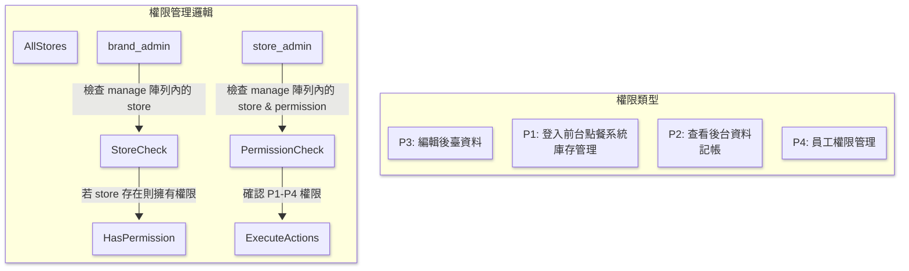

# online-order-system

This template should help get you started developing with Vue 3 in Vite.

## Recommended IDE Setup

[VSCode](https://code.visualstudio.com/) + [Volar](https://marketplace.visualstudio.com/items?itemName=Vue.volar) (and disable Vetur).

## Customize configuration

See [Vite Configuration Reference](https://vite.dev/config/).

## Project Setup

```sh
yarn
```

### Compile and Hot-Reload for Development

```sh
yarn dev
```

### Compile and Minify for Production

```sh
yarn build
```

### Run Unit Tests with [Vitest](https://vitest.dev/)

```sh
yarn test:unit
```

### Run End-to-End Tests with [Cypress](https://www.cypress.io/)

```sh
yarn test:e2e:dev
```

This runs the end-to-end tests against the Vite development server.
It is much faster than the production build.

But it's still recommended to test the production build with `test:e2e` before deploying (e.g. in CI environments):

```sh
yarn build
yarn test:e2e
```

### Lint with [ESLint](https://eslint.org/)

```sh
yarn lint
```

# 命名風格

## **資料夾命名規則**

- 頂層目錄命名 (使用 camelCase)
- 業務邏輯子目錄 (使用 PascalCase)
- 組件目錄 (使用 PascalCase)
- 視圖目錄 (使用 camelCase)

## **檔案命名規則詳解**

1. 模型檔案 (Models)

命名風格：PascalCase + 單數
原因：代表類或構造函數，符合OOP原則
範例：MainDish.js, Order.js

2. Vue組件檔案 (Components)

命名風格：PascalCase
原因：Vue官方建議，與元件註冊名稱一致
範例：CartItem.vue, MenuList.vue

3. 視圖檔案 (Views)

命名風格：PascalCase
原因：實際上也是Vue組件，遵循相同規則
範例：Dashboard.vue, MenuPage.vue

4. 工具函數檔案

命名風格：camelCase
原因：包含普通函數，符合JavaScript慣例
範例：priceCalculator.js, dateFormatter.js

5. Store檔案

命名風格：camelCase
原因：主要導出物件或函數，符合模組命名慣例
範例：cartStore.js, userStore.js

# 程式流程圖

[![主要架構](https://mermaid.ink/img/pako:eNqNV2tP40YU_SuWV-qnhDq287IqpPD6tiXS9lObCpnESSySmch2BBStBN2yG15LKrb7gvLapd1dWtouWpoNffwZxo7_RcczjmM7DiqIEM8959w7c2dOJitsEZYUVmLj8XgBFCEoqxWpABjGqCp1RWJKSllu1gxnpAbhgsQABZIHeRk2DYlRagsFQLjlGlwsVmXNYL6YcBD0Z16TQWlucnp2LvdVgUV7a9bGttX527o4sdoP0d4JkyuwXw_gE1DXMc75FxgfyExEy0xEwHNzJdmQ52VdwZybznXv8pH59AXqngewU6pe1Ul1vd0DrBwITsqGUoHa8mzDUCHQHZR9cohaZ_Zaxz5eD2D9mOHoPQNqSo53qu8-s7fe5fhAOFeqqyCn62oF1BVgYJg3N9R6aK_vRIgRSsJT9Ai5xCgwHwHmR4GFCLAQAN9VQJNoOiv39CJSSlNkUqPvyUXhP705X9HkRjWEdVcogXZW0dFRhKgfNFxRYlBRMPq5YjTkikvf2LHOf7Ou3tvHwZbnNViHTiedTfPvA3vzT-vy2vrwRwA0vTQJmw2CQevb5u4-anXCu6oIm8DwYObmc_TgYxjm1JvHJXkV42rsH0-De7CpG7CuaJOOngtGF6c33S7qXJqtK2u_Yz87iCDeq8JGQwWVSXwo-0ku_7I23vauN6PyVJXiwmwzmML60MZZrNNu791OBAfQTpyjX5_3Wo_wWqEnF-bjn1HrKggjm4Qcv97qT6jdCkadnWZfH9qv21EpRFLMttmKjCbpVnDOCeloFCblZH_zLV5e8-jMOtiKwqS9iaDTQ7OzTzGfzWvjTlnXh-iHI-vJm0_R2kHv8lVAQAElquO4FhOPj_tNj_nE710U5w8P4AO3wpyQHUTwxjDRPQwY77qLH-fTi8cZtL2O2uf4XbxveJgVdjc81H9LlYYAmG6vvjIfn5HCg-C-bhATlqDY0PwI0m9q3pSobQUfBaoRwOOk5t6aebBh_rJpv2jnE7E8H8sLPuHEEIuPZN1KEUYliuVFH5H3ExMkQJ0JTwSQl-ToVtFzYu62b_7ZD1Kp3_q1-QFgKOewkOd_FOo5XWiD9M0NZwza2MiaxwdaFONlIoJ9l3O2XNjMnNaGfGq4uvH_gWHoRF3bevmdOweyB8NJ3aUKaVKszwVH98ifC61u4ZW-LRGIbgdwW-b29zYIGDTaXTTgngJ_vf3Kuq-p21EJ0ZUQSfj4o7n3svf-LTZqvEjU27Ddod-_p-5HOe4OAUnSv34u8oijKSd_2h1LBxi6sVxT_B_nTFmt1aQ7E9wMNzMV0w0NLijSncR0lpuZcR_ji2rJqEpiY8mvQdyUksvZsscUBCFI44O0oW5RiSw3jVN6KhyXEjnOz8PLQ5G5HOeUVoQ1qEmLVdVQ_LnZGFvR1BIrleWarsRY3Oy67DyzK-ROw5J7c4GV8Nv-3ZmN0ZBzgaYR5xLtjZKbNB3Hv-A-TtGQwZcQ1lnJ0Jo4iQablaqXstnAc1OmVBlfnQYQ_Cnk7jtWSolEgpVW2CVWSojJMS6dETLpbEpIZzkxE2OXWSnDj2USSVHMpAUxnRQz92PsNyRnYozLcGIqzfFJPpPMpjJCjFVKKm7pXfpVgXxjuP8fLy2XcA?type=png)](https://mermaid.live/edit#pako:eNqNV2tP40YU_SuWV-qnhDq287IqpPD6tiXS9lObCpnESSySmch2BBStBN2yG15LKrb7gvLapd1dWtouWpoNffwZxo7_RcczjmM7DiqIEM8959w7c2dOJitsEZYUVmLj8XgBFCEoqxWpABjGqCp1RWJKSllu1gxnpAbhgsQABZIHeRk2DYlRagsFQLjlGlwsVmXNYL6YcBD0Z16TQWlucnp2LvdVgUV7a9bGttX527o4sdoP0d4JkyuwXw_gE1DXMc75FxgfyExEy0xEwHNzJdmQ52VdwZybznXv8pH59AXqngewU6pe1Ul1vd0DrBwITsqGUoHa8mzDUCHQHZR9cohaZ_Zaxz5eD2D9mOHoPQNqSo53qu8-s7fe5fhAOFeqqyCn62oF1BVgYJg3N9R6aK_vRIgRSsJT9Ai5xCgwHwHmR4GFCLAQAN9VQJNoOiv39CJSSlNkUqPvyUXhP705X9HkRjWEdVcogXZW0dFRhKgfNFxRYlBRMPq5YjTkikvf2LHOf7Ou3tvHwZbnNViHTiedTfPvA3vzT-vy2vrwRwA0vTQJmw2CQevb5u4-anXCu6oIm8DwYObmc_TgYxjm1JvHJXkV42rsH0-De7CpG7CuaJOOngtGF6c33S7qXJqtK2u_Yz87iCDeq8JGQwWVSXwo-0ku_7I23vauN6PyVJXiwmwzmML60MZZrNNu791OBAfQTpyjX5_3Wo_wWqEnF-bjn1HrKggjm4Qcv97qT6jdCkadnWZfH9qv21EpRFLMttmKjCbpVnDOCeloFCblZH_zLV5e8-jMOtiKwqS9iaDTQ7OzTzGfzWvjTlnXh-iHI-vJm0_R2kHv8lVAQAElquO4FhOPj_tNj_nE710U5w8P4AO3wpyQHUTwxjDRPQwY77qLH-fTi8cZtL2O2uf4XbxveJgVdjc81H9LlYYAmG6vvjIfn5HCg-C-bhATlqDY0PwI0m9q3pSobQUfBaoRwOOk5t6aebBh_rJpv2jnE7E8H8sLPuHEEIuPZN1KEUYliuVFH5H3ExMkQJ0JTwSQl-ToVtFzYu62b_7ZD1Kp3_q1-QFgKOewkOd_FOo5XWiD9M0NZwza2MiaxwdaFONlIoJ9l3O2XNjMnNaGfGq4uvH_gWHoRF3bevmdOweyB8NJ3aUKaVKszwVH98ifC61u4ZW-LRGIbgdwW-b29zYIGDTaXTTgngJ_vf3Kuq-p21EJ0ZUQSfj4o7n3svf-LTZqvEjU27Ddod-_p-5HOe4OAUnSv34u8oijKSd_2h1LBxi6sVxT_B_nTFmt1aQ7E9wMNzMV0w0NLijSncR0lpuZcR_ji2rJqEpiY8mvQdyUksvZsscUBCFI44O0oW5RiSw3jVN6KhyXEjnOz8PLQ5G5HOeUVoQ1qEmLVdVQ_LnZGFvR1BIrleWarsRY3Oy67DyzK-ROw5J7c4GV8Nv-3ZmN0ZBzgaYR5xLtjZKbNB3Hv-A-TtGQwZcQ1lnJ0Jo4iQablaqXstnAc1OmVBlfnQYQ_Cnk7jtWSolEgpVW2CVWSojJMS6dETLpbEpIZzkxE2OXWSnDj2USSVHMpAUxnRQz92PsNyRnYozLcGIqzfFJPpPMpjJCjFVKKm7pXfpVgXxjuP8fLy2XcA)



# 資料庫ER圖

```mermaid
---
config:
  theme: default
---
erDiagram
    Admin {
        ObjectId _id
        String name
        String password
        String role
        ObjectId brand
        Object[] manage
        Boolean isActive
        Date lastLogin
        Date createdAt
        Date updatedAt
    }
    Brand {
        ObjectId _id
        String name
        String description
        Object image
        Date createdAt
        Date updatedAt
    }
    User {
        ObjectId _id
        String name
        String email
        String password
        String phone
        Object[] addresses
        ObjectId[] orderHistory
        Object preferences
        Object[] brandPoints
        Date dateOfBirth
        String gender
        Boolean isActive
        String resetPasswordToken
        Date resetPasswordExpire
        Date createdAt
        Date updatedAt
    }
    DishTemplate {
        ObjectId _id
        String name
        Number basePrice
        Object[] optionCategories
        Object image
        String description
        String[] tags
    }
    DishInstance {
        ObjectId _id
        ObjectId templateId
        String name
        Number basePrice
        Object[] options
        String specialInstructions
        Number finalPrice
        Date createdAt
        Date updatedAt
    }
    OptionCategory {
        ObjectId _id
        String name
        String inputType
        Object[] options
    }
    Option {
        ObjectId _id
        String name
        ObjectId refDishTemplate
        Number price
    }
    Menu {
        ObjectId _id
        String name
        ObjectId store
        ObjectId brand
        Object[] categories
        Boolean isActive
        Date createdAt
        Date updatedAt
    }
    Store {
        ObjectId _id
        String name
        ObjectId brand
        Object[] businessHours
        ObjectId menuId
        Object[] announcements
        Object image
        Boolean isActive
        Date createdAt
        Date updatedAt
    }
    Inventory {
        ObjectId _id
        ObjectId store
        ObjectId dish
        String dishName
        Number stock
        Number dailyLimit
        Boolean isInventoryTracked
        Date createdAt
        Date updatedAt
    }
    StockLog {
        ObjectId _id
        ObjectId store
        ObjectId dish
        String dishName
        Number previousStock
        Number newStock
        Number changeAmount
        String changeType
        String reason
        ObjectId order
        ObjectId admin
        Date createdAt
        Date updatedAt
    }
    Order {
        ObjectId _id
        String orderDateCode
        Number sequence
        ObjectId store
        ObjectId brand
        ObjectId user
        String orderType
        String status
        Object[] items
        Number subtotal
        Number serviceCharge
        Object[] discounts
        Number totalDiscount
        Number total
        String paymentType
        String paymentMethod
        String onlinePaymentCode
        Object customerInfo
        Object deliveryInfo
        Object dineInInfo
        Date estimatedPickupTime
        String notes
        String cancelReason
        ObjectId cancelledBy
        String cancelledByModel
        Date cancelledAt
        Date createdAt
        Date updatedAt
    }
    PointRule {
        ObjectId _id
        ObjectId brand
        String name
        String description
        String type
        Number conversionRate
        Number minimumAmount
        Boolean isActive
        Date createdAt
        Date updatedAt
    }
    PointTransaction {
        ObjectId _id
        ObjectId user
        ObjectId brand
        String type
        Number points
        Number balance
        String source
        String sourceModel
        ObjectId sourceId
        ObjectId order
        ObjectId couponInstance
        Date createdAt
        Date updatedAt
    }
    CouponTemplate {
        ObjectId _id
        ObjectId brand
        String name
        String description
        String couponType
        Number pointCost
        Object discountInfo
        Object exchangeInfo
        Number validityPeriod
        Boolean isActive
        ObjectId[] stores
        Date startDate
        Date endDate
        Number totalIssued
        Number maxIssuance
        Date createdAt
        Date updatedAt
    }
    CouponInstance {
        ObjectId _id
        ObjectId template
        String couponName
        String couponType
        Number discount
        Object[] exchangeItems
        ObjectId user
        Boolean isUsed
        Date usedAt
        ObjectId order
        Date acquiredAt
        Date expiryDate
        Number pointsUsed
    }
    Admin ||--o{ Store : "manages"
    Brand ||--o{ Store : "has"
    Brand ||--o{ Admin : "has"
    Brand ||--o{ PointRule : "has"
    Brand ||--o{ CouponTemplate : "has"
    User ||--o{ CouponInstance : "owns"
    User ||--o{ Order : "places"
    User ||--o{ PointTransaction : "has"
    Store ||--o{ Inventory : "tracks"
    Store ||--o{ Order : "receives"
    Store ||--o{ StockLog : "has"
    Store ||--o| Menu : "has"
    DishTemplate ||--o{ DishInstance : "instantiates"
    DishTemplate ||--o{ Inventory : "tracked_in"
    OptionCategory ||--o{ Option : "contains"
    DishTemplate }o--o{ OptionCategory : "uses"
    Menu }o--o{ DishTemplate : "includes"
    Order ||--o{ DishInstance : "contains"
    CouponTemplate ||--o{ CouponInstance : "instantiates"
    CouponInstance ||--o{ Order : "applied_to"
    Order ||--o{ StockLog : "generates"
    Order ||--o{ PointTransaction : "generates"
```


