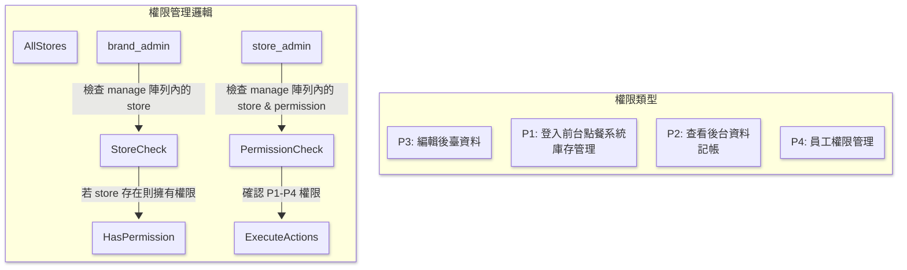
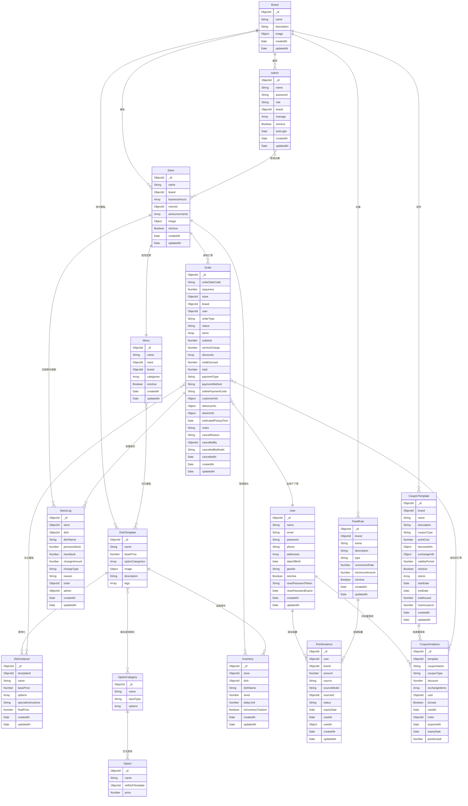

# online-order-system

This template should help get you started developing with Vue 3 in Vite.

## Recommended IDE Setup

[VSCode](https://code.visualstudio.com/) + [Volar](https://marketplace.visualstudio.com/items?itemName=Vue.volar) (and disable Vetur).

## Customize configuration

See [Vite Configuration Reference](https://vite.dev/config/).

## Project Setup

```sh
yarn
```

### Compile and Hot-Reload for Development

```sh
yarn dev
```

### Compile and Minify for Production

```sh
yarn build
```

### Run Unit Tests with [Vitest](https://vitest.dev/)

```sh
yarn test:unit
```

### Run End-to-End Tests with [Cypress](https://www.cypress.io/)

```sh
yarn test:e2e:dev
```

This runs the end-to-end tests against the Vite development server.
It is much faster than the production build.

But it's still recommended to test the production build with `test:e2e` before deploying (e.g. in CI environments):

```sh
yarn build
yarn test:e2e
```

### Lint with [ESLint](https://eslint.org/)

```sh
yarn lint
```

# 命名風格

## **資料夾命名規則**

- 頂層目錄命名 (使用 camelCase)
- 業務邏輯子目錄 (使用 PascalCase)
- 組件目錄 (使用 PascalCase)
- 視圖目錄 (使用 camelCase)

## **檔案命名規則詳解**

1. 模型檔案 (Models)

命名風格：PascalCase + 單數
原因：代表類或構造函數，符合OOP原則
範例：MainDish.js, Order.js

2. Vue組件檔案 (Components)

命名風格：PascalCase
原因：Vue官方建議，與元件註冊名稱一致
範例：CartItem.vue, MenuList.vue

3. 視圖檔案 (Views)

命名風格：PascalCase
原因：實際上也是Vue組件，遵循相同規則
範例：Dashboard.vue, MenuPage.vue

4. 工具函數檔案

命名風格：camelCase
原因：包含普通函數，符合JavaScript慣例
範例：priceCalculator.js, dateFormatter.js

5. Store檔案

命名風格：camelCase
原因：主要導出物件或函數，符合模組命名慣例
範例：cartStore.js, userStore.js

# 程式流程圖




# 資料庫ER圖


