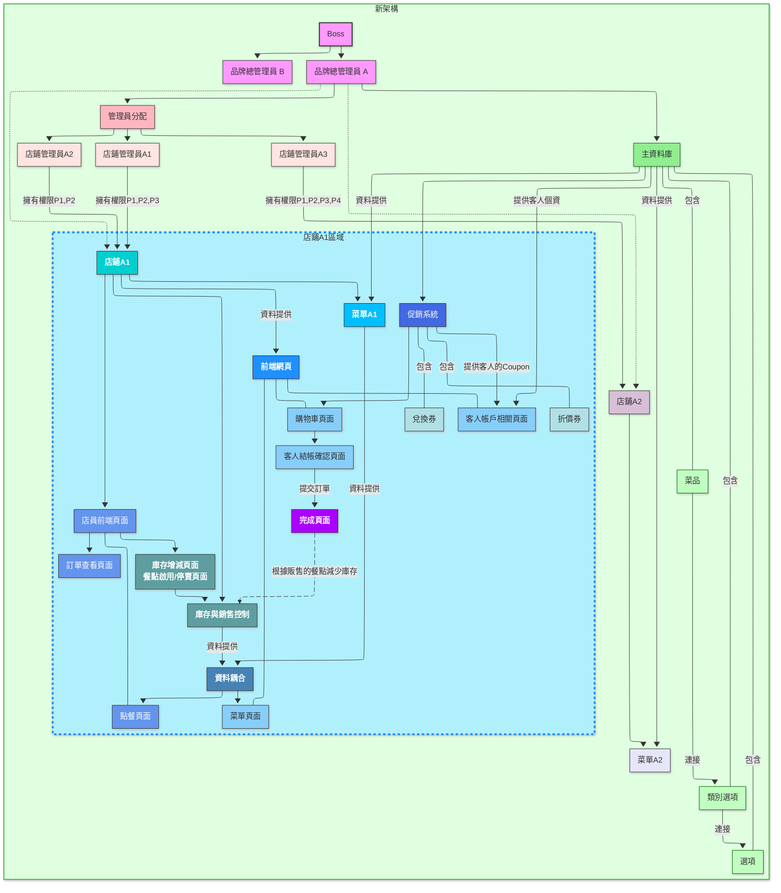
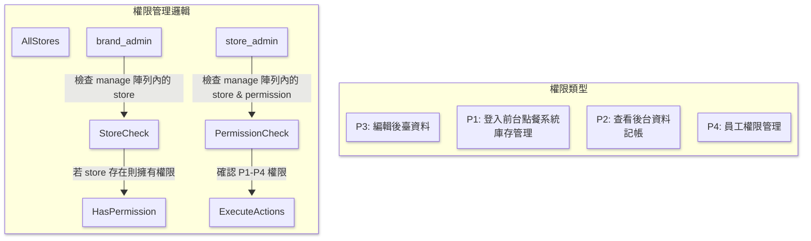
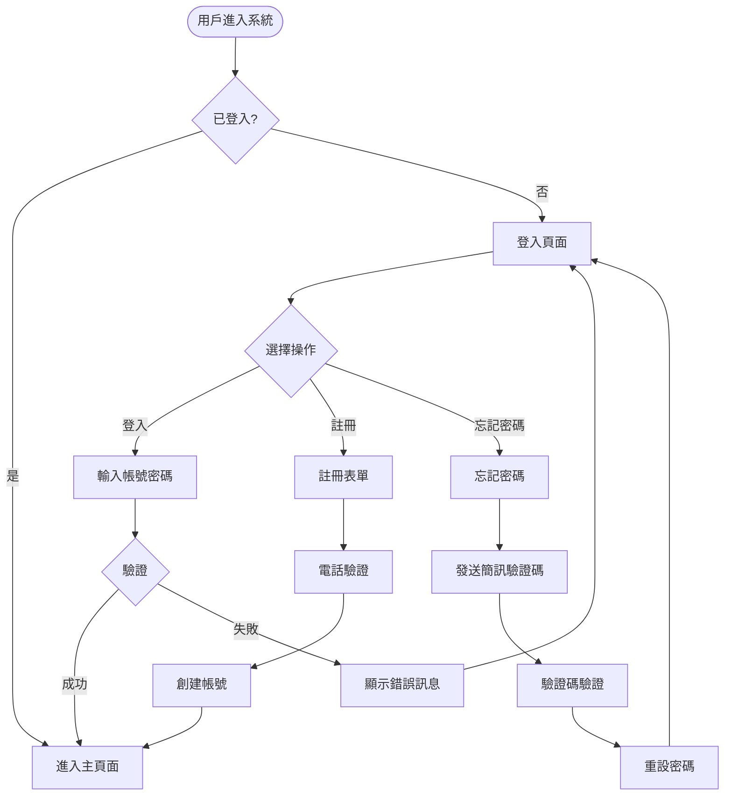
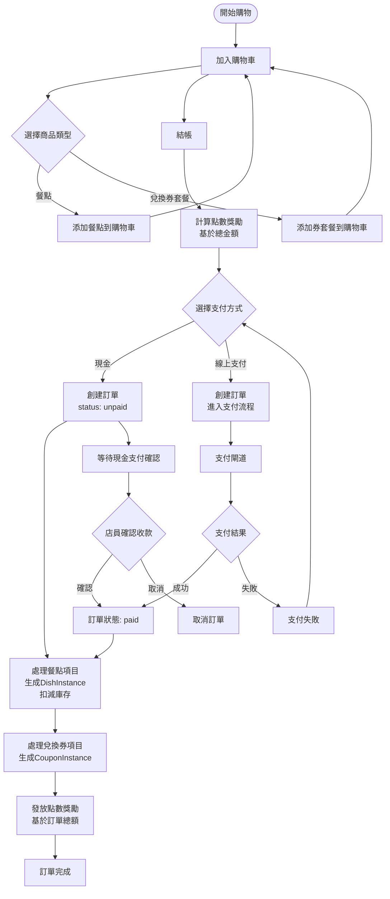
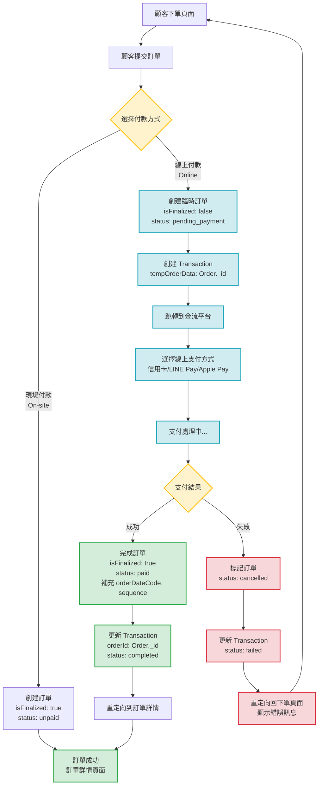
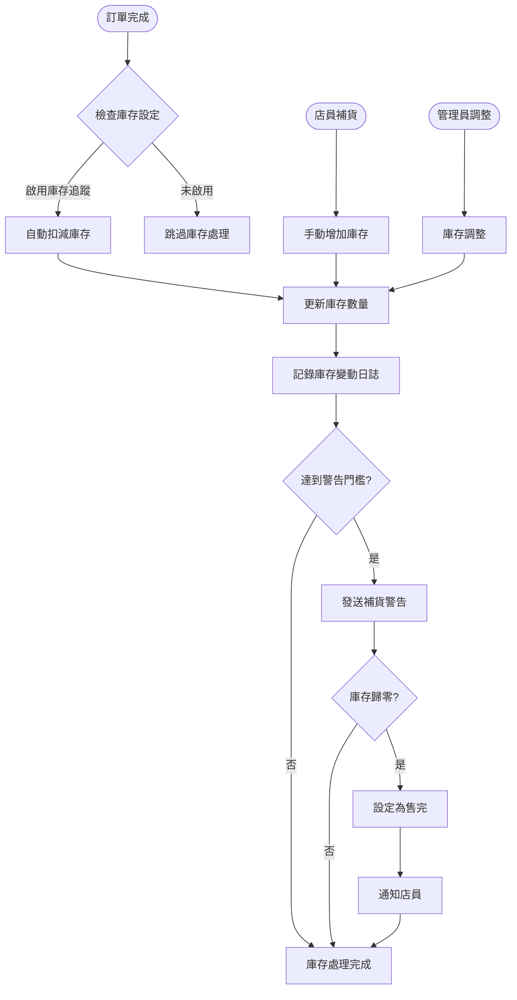

<div align="center">

# 🍽️ Multi-Brand Restaurant Ordering System

# 多品牌餐廳訂餐管理系統

[](./LICENSE)
[](https://vuejs.org/)
[](https://nodejs.org/)
[](https://www.mongodb.com/)

A modern, full-stack restaurant management system supporting multiple brands, real-time inventory tracking, and comprehensive order management.

現代化全端餐廳管理系統，支援多品牌管理、即時庫存追蹤與完整訂單管理功能。

[English](#english) | [繁體中文](#繁體中文)

</div>

---

## English

### 📋 Overview

This is a comprehensive multi-brand restaurant ordering and management system built with modern web technologies. The platform enables restaurant groups to manage multiple brands, each with multiple store locations, providing a complete solution for restaurant operations.

### ✨ Key Features

#### 🏢 **Multi-Brand Architecture**

- System administrators can manage multiple restaurant brands
- Each brand can have multiple store locations
- Centralized menu templates shared across brand locations
- Flexible store-specific customization

#### 📦 **Order Management**

- Support for dine-in, takeout, and delivery orders
- **Mixed cart system**: Combine food items and promotional bundles in a single transaction
- Real-time order tracking and status updates
- Multiple payment methods: cash, credit card, LINE Pay

#### 📊 **Inventory Control**

- Real-time stock tracking for all menu items
- Automatic inventory reduction on order completion
- Low stock alerts and sold-out management
- Detailed stock change logs with reasons

#### 🎁 **Promotion System**

- **Points accumulation**: Earn points based on order total
- **Discount coupons**: Percentage or fixed amount discounts
- **Exchange vouchers**: Redeem free items with points
- **Bundle deals**: Special promotional packages
- Points expiration management (FIFO)

#### 👥 **User & Permission Management**

- **Customer accounts**: Registration, profile management, order history
- **Boss (System Admin)**: Full system access, manage all brands
- **Brand Admin**: Manage specific brand's stores and settings
- **Store Admin**: Granular permissions (P1-P4) for store operations
  - P1: POS access, inventory management
  - P2: View backend data, accounting
  - P3: Edit backend data
  - P4: Employee permission management

#### 🛒 **Point-of-Sale (POS) System**

- Staff-focused ordering interface
- Quick order creation and modification
- Payment processing and confirmation
- Order queue management

### 🛠️ Tech Stack

**Frontend**

- Vue 3 + Composition API
- Vite (build tool)
- Pinia (state management)
- Vue Router 4
- Bootstrap Vue Next
- Vue i18n (internationalization)

**Backend**

- Express.js (Node.js framework)
- MongoDB + Mongoose ODM
- Express Session
- RESTful API architecture

**Testing**

- Vitest (unit testing)
- Cypress (E2E testing)

**External Integrations**

- UberEats API (delivery integration)
- KotSMS (SMS verification)
- LINE LIFF (LINE integration)
- TapPay (payment gateway)
- Cloudflare R2 (file storage)

### 🚀 Getting Started

#### Prerequisites

- Node.js 18+ and Yarn
- MongoDB 6.x
- Git

#### Installation

```bash
# Clone the repository
git clone <repository-url>
cd online-order-system

# Install dependencies
yarn install

# Set up environment variables
cp .env.example .env
# Edit .env and configure:
# - MongoDB_url
# - SESSION_SECRET
# - Payment gateway credentials
# - SMS service credentials
```

#### Development

```bash
# Start frontend development server (port 5173)
yarn dev

# Start backend server (port 8700) in another terminal
node server.js

# Run unit tests
yarn test:unit

# Run E2E tests
yarn test:e2e:dev
```

#### Production Build

```bash
# Build for production
yarn build

# Preview production build
yarn preview

# Run production server
NODE_ENV=production node server.js
```

### 📁 Project Structure

```
online-order-system/
├── src/                      # Frontend source code
│   ├── views/               # Page components
│   │   ├── auth/           # Authentication pages
│   │   ├── boss/           # System admin dashboard
│   │   ├── brandAdmin/     # Brand manager dashboard
│   │   ├── counter/        # POS interface
│   │   ├── customer/       # Customer-facing pages
│   │   └── landing/        # Marketing pages
│   ├── components/          # Reusable Vue components
│   ├── stores/             # Pinia state management
│   ├── router/             # Route definitions
│   ├── api/                # API client modules
│   └── i18n/               # Internationalization
├── server/                  # Backend source code
│   ├── models/             # Mongoose schemas
│   ├── controllers/        # Request handlers
│   ├── services/           # Business logic layer
│   ├── routes/             # Express routes
│   ├── middlewares/        # Auth, validation, error handling
│   └── utils/              # Utility functions
├── tests/                   # Test files
│   ├── unit/               # Unit tests
│   └── e2e/                # E2E tests
└── public/                  # Static assets
```

### 🎯 Core Domain Models

- **Brand**: Top-level restaurant brand
- **Store**: Individual store locations
- **DishTemplate**: Centralized menu item templates
- **DishInstance**: Specific dish instances in orders
- **Menu**: Store-specific menu configurations
- **Order**: Customer orders (supports mixed items)
- **Inventory**: Real-time stock management
- **User**: Customer accounts
- **Admin**: System/brand/store administrators
- **PointRule**: Points accumulation rules
- **PointInstance**: Individual point records
- **CouponTemplate**: Reusable coupon templates
- **CouponInstance**: User-specific coupon instances
- **PromotionMenu**: Bundle promotion packages

### 🔐 API Structure

```
/api
├── /auth                    # Authentication
├── /user-profile           # Customer profile management
├── /order-customer         # Customer order operations
├── /order-admin            # Admin order management
├── /store                  # Store management
├── /menu                   # Menu management
├── /inventory              # Inventory operations
├── /promotion              # Promotion system
└── /admin                  # Admin user management
```

### 📊 System Architecture



See the [full documentation](#程式流程圖) for detailed flow diagrams and ER diagrams.

### 🧪 Testing

```bash
# Run all unit tests
NODE_ENV=test yarn test:unit

# Run specific test file
NODE_ENV=test yarn test:unit tests/unit/path/to/test.js --reporter=verbose --no-watch

# Run E2E tests
yarn test:e2e
```

### 🌐 Internationalization

The system supports:

- Traditional Chinese (繁體中文)
- English

### 📄 License

This project is licensed under a [Modified MIT License](./LICENSE) — for non-commercial use only.

### 🤝 Contributing

Contributions, issues, and feature requests are welcome!

---

## 繁體中文

### 📋 專案簡介

這是一個採用現代化技術棧開發的全端多品牌餐廳訂餐管理系統。本平台讓餐飲集團能夠管理多個品牌，每個品牌可擁有多家分店，提供完整的餐廳營運解決方案。

### ✨ 核心功能

#### 🏢 **多品牌架構**

- 系統管理員可管理多個餐飲品牌
- 每個品牌下可有多家分店
- 集中化的菜單模板可跨店共用
- 支援店鋪個別化設定

#### 📦 **訂單管理**

- 支援內用、外帶、外送訂單
- **混合購物車系統**：可同時訂購餐點與促銷套餐
- 即時訂單追蹤與狀態更新
- 多元支付方式：現金、信用卡、LINE Pay

#### 📊 **庫存控制**

- 所有菜單項目的即時庫存追蹤
- 訂單完成時自動扣減庫存
- 低庫存警示與售完管理
- 詳細的庫存變動記錄

#### 🎁 **促銷系統**

- **點數累積**：根據訂單金額獲得點數
- **折價券**：百分比或固定金額折扣
- **兌換券**：使用點數兌換免費商品
- **套餐優惠**：特殊促銷組合
- 點數到期管理（先進先出）

#### 👥 **用戶與權限管理**

- **顧客帳戶**：註冊、個人資料管理、訂單歷史
- **系統管理員（Boss）**：完整系統權限，管理所有品牌
- **品牌管理員**：管理特定品牌的店鋪與設定
- **店鋪管理員**：細分權限（P1-P4）管理店鋪營運
  - P1：登入前台點餐系統、庫存管理
  - P2：查看後台資料、記帳
  - P3：編輯後台資料
  - P4：員工權限管理

#### 🛒 **櫃檯系統（POS）**

- 店員專用點餐介面
- 快速建立與修改訂單
- 付款處理與確認
- 訂單佇列管理

### 🛠️ 技術棧

**前端**

- Vue 3 + Composition API
- Vite（建置工具）
- Pinia（狀態管理）
- Vue Router 4
- Bootstrap Vue Next
- Vue i18n（國際化）

**後端**

- Express.js（Node.js 框架）
- MongoDB + Mongoose ODM
- Express Session
- RESTful API 架構

**測試**

- Vitest（單元測試）
- Cypress（端對端測試）

**外部整合**

- UberEats API（外送整合）
- KotSMS（簡訊驗證）
- LINE LIFF（LINE 整合）
- TapPay（金流閘道）
- Cloudflare R2（檔案儲存）

### 🚀 快速開始

#### 環境需求

- Node.js 18+ 與 Yarn
- MongoDB 6.x
- Git

#### 安裝步驟

```bash
# 複製專案
git clone <repository-url>
cd online-order-system

# 安裝相依套件
yarn install

# 設定環境變數
cp .env.example .env
# 編輯 .env 並設定：
# - MongoDB_url
# - SESSION_SECRET
# - 金流閘道憑證
# - 簡訊服務憑證
```

#### 開發環境

```bash
# 啟動前端開發伺服器（port 5173）
yarn dev

# 在另一個終端啟動後端伺服器（port 8700）
node server.js

# 執行單元測試
yarn test:unit

# 執行端對端測試
yarn test:e2e:dev
```

#### 正式環境建置

```bash
# 建置正式版本
yarn build

# 預覽正式版本
yarn preview

# 執行正式環境伺服器
NODE_ENV=production node server.js
```

### 📁 專案結構

```
online-order-system/
├── src/                      # 前端原始碼
│   ├── views/               # 頁面元件
│   │   ├── auth/           # 認證頁面
│   │   ├── boss/           # 系統管理員儀表板
│   │   ├── brandAdmin/     # 品牌管理員儀表板
│   │   ├── counter/        # 櫃檯系統介面
│   │   ├── customer/       # 顧客前台頁面
│   │   └── landing/        # 行銷頁面
│   ├── components/          # 可重用 Vue 元件
│   ├── stores/             # Pinia 狀態管理
│   ├── router/             # 路由定義
│   ├── api/                # API 客戶端模組
│   └── i18n/               # 國際化
├── server/                  # 後端原始碼
│   ├── models/             # Mongoose 資料模型
│   ├── controllers/        # 請求處理器
│   ├── services/           # 商業邏輯層
│   ├── routes/             # Express 路由
│   ├── middlewares/        # 中介層（認證、驗證、錯誤處理）
│   └── utils/              # 工具函數
├── tests/                   # 測試檔案
│   ├── unit/               # 單元測試
│   └── e2e/                # 端對端測試
└── public/                  # 靜態資源
```

### 🎯 核心資料模型

- **Brand**：頂層餐飲品牌
- **Store**：個別店鋪據點
- **DishTemplate**：集中式菜單項目模板
- **DishInstance**：訂單中的特定餐點實例
- **Menu**：店鋪專屬菜單配置
- **Order**：顧客訂單（支援混合商品）
- **Inventory**：即時庫存管理
- **User**：顧客帳戶
- **Admin**：系統/品牌/店鋪管理員
- **PointRule**：點數累積規則
- **PointInstance**：個別點數記錄
- **CouponTemplate**：可重用優惠券模板
- **CouponInstance**：使用者專屬優惠券實例
- **PromotionMenu**：套餐促銷組合

### 🔐 API 架構

```
/api
├── /auth                    # 認證
├── /user-profile           # 顧客個人資料管理
├── /order-customer         # 顧客訂單操作
├── /order-admin            # 管理員訂單管理
├── /store                  # 店鋪管理
├── /menu                   # 菜單管理
├── /inventory              # 庫存操作
├── /promotion              # 促銷系統
└── /admin                  # 管理員用戶管理
```

### 📊 系統架構


詳細的流程圖與 ER 圖請參閱[完整文件](#程式流程圖)。

### 🧪 測試

```bash
# 執行所有單元測試
NODE_ENV=test yarn test:unit

# 執行特定測試檔案
NODE_ENV=test yarn test:unit tests/unit/path/to/test.js --reporter=verbose --no-watch

# 執行端對端測試
yarn test:e2e
```

### 🌐 國際化支援

系統支援：

- 繁體中文
- English

### 📝 開發指南

#### 命名規範

**資料夾命名**

- 頂層目錄：camelCase
- 業務邏輯子目錄：PascalCase
- 組件目錄：PascalCase
- 視圖目錄：camelCase

**檔案命名**

- 模型檔案（Models）：PascalCase + 單數（例：`Order.js`, `DishTemplate.js`）
- Vue 組件檔案：PascalCase（例：`MenuList.vue`, `CartItem.vue`）
- 視圖檔案（Views）：PascalCase（例：`Dashboard.vue`）
- 工具函數檔案：camelCase（例：`priceCalculator.js`, `dateFormatter.js`）
- Store 檔案：camelCase（例：`cartStore.js`, `userStore.js`）

#### 架構分層

| 層級           | 職責                       | 應包含                                       | 不應包含                |
| -------------- | -------------------------- | -------------------------------------------- | ----------------------- |
| **Model**      | 定義資料結構、與資料庫互動 | Schema 定義、欄位驗證、hooks、實例方法       | ❌ 處理請求與回應       |
| **Controller** | 接收請求與回應             | 取得 req/params、呼叫 service、回傳 response | ❌ 商業邏輯             |
| **Service**    | 處理業務邏輯與流程決策     | 建立/更新資料、套用規則、發送通知            | ❌ 接觸 req/res         |
| **Utils**      | 可重用的純函數工具         | 格式化、驗證、計算等通用函數                 | ❌ 依賴資料庫或商業資料 |

### 📄 授權條款

本專案採用 [Modified MIT License](./LICENSE) 授權 — 僅限非商業用途使用。

### 🤝 貢獻

歡迎提交 issue、功能請求與貢獻！

---

## 📊 程式流程圖

### 系統架構圖



### 權限管理邏輯



### 資料庫 ER 圖

```mermaid
---
config:
  theme: default
---
erDiagram
    %% 基礎架構實體
    Brand {
        ObjectId _id
        String name
        String description
        Object image
        Boolean isActive
        Date createdAt
        Date updatedAt
    }

    Store {
        ObjectId _id
        String name
        ObjectId brand
        Array businessHours
        Array announcements
        Object image
        Object serviceSettings
        Boolean isActive
        Date createdAt
        Date updatedAt
    }

    User {
        ObjectId _id
        String name
        String email
        String password
        String phone
        Array addresses
        Date dateOfBirth
        String gender
        Boolean isActive
        String resetPasswordToken
        Date resetPasswordExpire
        Date createdAt
        Date updatedAt
    }

    Admin {
        ObjectId _id
        String name
        String password
        String role
        ObjectId brand
        ObjectId store
        Boolean isActive
        Date lastLogin
        ObjectId createdBy
        Date createdAt
        Date updatedAt
    }

    %% 餐點相關實體
    DishTemplate {
        ObjectId _id
        ObjectId brand
        String name
        Number basePrice
        Array optionCategories
        Object image
        String description
        Array tags
        Date createdAt
        Date updatedAt
    }

    DishInstance {
        ObjectId _id
        ObjectId brand
        ObjectId templateId
        String name
        Number basePrice
        Array options
        Number finalPrice
        Date createdAt
        Date updatedAt
    }

    OptionCategory {
        ObjectId _id
        ObjectId brand
        String name
        String inputType
        Array options
        Date createdAt
        Date updatedAt
    }

    Option {
        ObjectId _id
        ObjectId brand
        String name
        ObjectId refDishTemplate
        Number price
        Array tags
        Date createdAt
        Date updatedAt
    }

    Menu {
        ObjectId _id
        String name
        ObjectId store
        ObjectId brand
        Array categories
        Boolean isActive
        Date createdAt
        Date updatedAt
    }

    %% 庫存管理實體
    Inventory {
        ObjectId _id
        ObjectId brand
        ObjectId store
        String inventoryType
        ObjectId dish
        String itemName
        Number totalStock
        Boolean enableAvailableStock
        Number availableStock
        Number minStockAlert
        Number targetStockLevel
        Boolean isInventoryTracked
        Boolean isSoldOut
        Date createdAt
        Date updatedAt
    }

    StockLog {
        ObjectId _id
        ObjectId brand
        ObjectId store
        String inventoryType
        ObjectId dish
        String itemName
        Number previousStock
        Number newStock
        Number changeAmount
        String changeType
        String reason
        ObjectId order
        ObjectId admin
        Date createdAt
    }

    %% 訂單系統實體 (支援混合購買)
    Order {
        ObjectId _id
        ObjectId store
        ObjectId brand
        ObjectId user
        String orderDateCode
        Number sequence
        String orderType
        String status
        Array items
        Number dishSubtotal
        Number couponSubtotal
        Number subtotal
        Number serviceCharge
        Array discounts
        Number totalDiscount
        Number total
        Number pointsEarned
        Number pointsCalculationBase
        Object pointsRule
        String paymentType
        String paymentMethod
        Object customerInfo
        Object deliveryInfo
        Object dineInInfo
        String notes
        Date createdAt
        Date updatedAt
    }

    %% 促銷系統實體
    PointRule {
        ObjectId _id
        ObjectId brand
        String name
        String description
        String type
        Number conversionRate
        Number minimumAmount
        Number validityDays
        Boolean isActive
        Date createdAt
        Date updatedAt
    }

    PointInstance {
        ObjectId _id
        ObjectId user
        ObjectId brand
        Number amount
        String source
        String sourceModel
        ObjectId sourceId
        String status
        Date expiryDate
        Date usedAt
        Object usedIn
        Date createdAt
        Date updatedAt
    }

    CouponTemplate {
        ObjectId _id
        ObjectId brand
        String name
        String description
        String couponType
        Number pointCost
        Object discountInfo
        Object exchangeInfo
        Number validityPeriod
        Boolean isActive
        Array stores
        Number totalIssued
        Date createdAt
        Date updatedAt
    }

    CouponInstance {
        ObjectId _id
        ObjectId brand
        ObjectId template
        String couponName
        String couponType
        Number discount
        Array exchangeItems
        ObjectId user
        Boolean isUsed
        Date usedAt
        ObjectId order
        Date acquiredAt
        Date expiryDate
        Number pointsUsed
        Date createdAt
        Date updatedAt
    }

    PromotionMenu {
        ObjectId _id
        ObjectId brand
        String name
        String description
        Array items
        Object pricing
        Object purchaseTypes
        Boolean isActive
        Number totalSold
        Date validFrom
        Date validUntil
        Array stores
        Date createdAt
        Date updatedAt
    }

    %% 實體關係
    Brand ||--o{ Store : "owns"
    Brand ||--o{ Admin : "employs"
    Brand ||--o{ DishTemplate : "provides"
    Brand ||--o{ OptionCategory : "defines"
    Brand ||--o{ Option : "defines"
    Brand ||--o{ PointRule : "sets"
    Brand ||--o{ CouponTemplate : "offers"
    Brand ||--o{ PromotionMenu : "creates"

    Store ||--o{ Admin : "managed_by"
    Store ||--o{ Order : "receives"
    Store ||--o{ Inventory : "manages"
    Store ||--o{ StockLog : "logs"
    Store ||--|| Menu : "uses"

    User ||--o{ Order : "places"
    User ||--o{ PointInstance : "owns"
    User ||--o{ CouponInstance : "holds"

    DishTemplate ||--o{ DishInstance : "instantiates"
    DishTemplate ||--o{ Inventory : "tracked_in"
    DishTemplate }o--o{ OptionCategory : "has_options"
    OptionCategory ||--o{ Option : "contains"

    Order }o--o{ DishInstance : "includes"
    Order ||--o{ StockLog : "affects_inventory"
    Order ||--o{ PointInstance : "generates"
    Order }o--o{ CouponInstance : "uses_coupons"

    PointRule ||--o{ PointInstance : "creates"
    CouponTemplate ||--o{ CouponInstance : "instantiates"
    PromotionMenu }o--o{ CouponTemplate : "bundles"

    Menu }o--o{ DishTemplate : "displays"
```



### 核心業務流程

#### 用戶認證與註冊流程



#### 混合購買訂單流程



#### 訂單提交流程



#### 促銷系統流程


#### 庫存管理流程



#### 點數系統流程


#### 管理員權限控制流程


---

<div align="center">

Made with ❤️ for the restaurant industry

</div>
