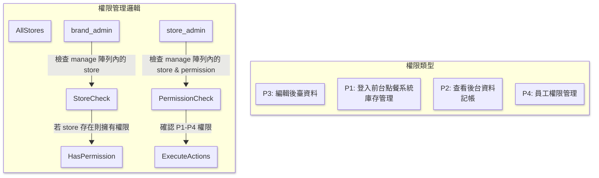
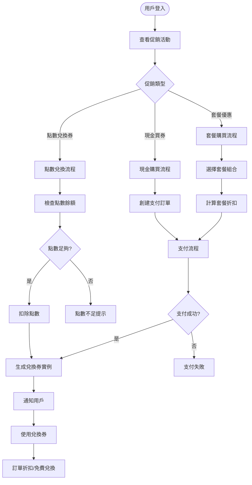
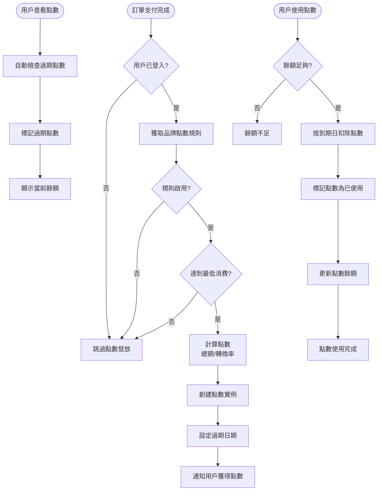
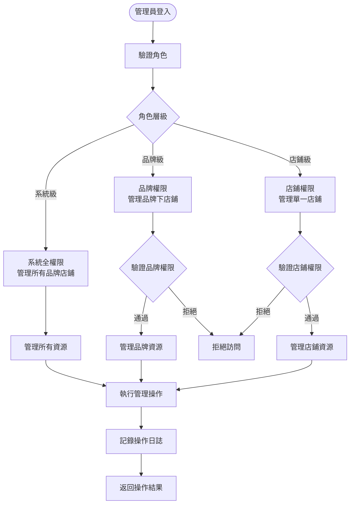
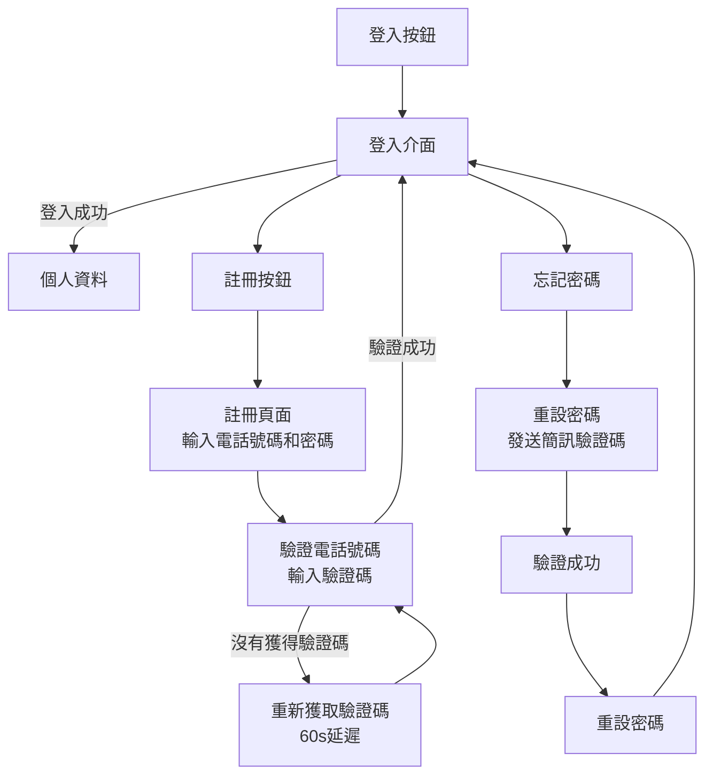
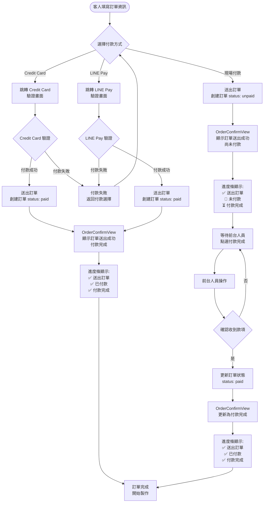
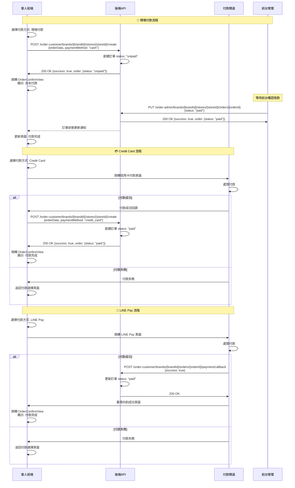

# online-order-system

This template should help get you started developing with Vue 3 in Vite.

## Recommended IDE Setup

[VSCode](https://code.visualstudio.com/) + [Volar](https://marketplace.visualstudio.com/items?itemName=Vue.volar) (and disable Vetur).

## Customize configuration

See [Vite Configuration Reference](https://vite.dev/config/).

## Project Setup

```sh
yarn
```

### Compile and Hot-Reload for Development

```sh
yarn dev
```

### Compile and Minify for Production

```sh
yarn build
```

### Run Unit Tests with [Vitest](https://vitest.dev/)

```sh
yarn test:unit
```

### Run End-to-End Tests with [Cypress](https://www.cypress.io/)

```sh
yarn test:e2e:dev
```

This runs the end-to-end tests against the Vite development server.
It is much faster than the production build.

But it's still recommended to test the production build with `test:e2e` before deploying (e.g. in CI environments):

```sh
yarn build
yarn test:e2e
```

### Lint with [ESLint](https://eslint.org/)

```sh
yarn lint
```

# License

This project is licensed under a [Modified MIT License](./LICENSE) — for non-commercial use only.

# 命名風格

## **資料夾命名規則**

- 頂層目錄命名 (使用 camelCase)
- 業務邏輯子目錄 (使用 PascalCase)
- 組件目錄 (使用 PascalCase)
- 視圖目錄 (使用 camelCase)

## **檔案命名規則詳解**

1. 模型檔案 (Models)

命名風格：PascalCase + 單數
原因：代表類或構造函數，符合OOP原則
範例：MainDish.js, Order.js

2. Vue組件檔案 (Components)

命名風格：PascalCase
原因：Vue官方建議，與元件註冊名稱一致
範例：CartItem.vue, MenuList.vue

3. 視圖檔案 (Views)

命名風格：PascalCase
原因：實際上也是Vue組件，遵循相同規則
範例：Dashboard.vue, MenuPage.vue

4. 工具函數檔案

命名風格：camelCase
原因：包含普通函數，符合JavaScript慣例
範例：priceCalculator.js, dateFormatter.js

5. Store檔案

命名風格：camelCase
原因：主要導出物件或函數，符合模組命名慣例
範例：cartStore.js, userStore.js

# 程式流程圖




# 資料庫ER圖


# 系統核心流程圖

## 用戶認證與註冊流程


## 混合購買訂單流程 (新功能)


## 促銷系統流程



## 庫存管理流程


## 點數系統流程



## 管理員權限控制流程



# 內部各元件流程圖

### 客戶登入按鈕



### 訂單流程



### 訂單時序圖



# 各個資料夾裡面應該放什麼邏輯

## 📦 分層責任對照表（MVC 架構＋服務層）

| 層級           | 職責重點                                    | 應該包含的邏輯範例                                                                                                     | 不應該包含什麼                        |
| -------------- | ------------------------------------------- | ---------------------------------------------------------------------------------------------------------------------- | ------------------------------------- |
| **Model**      | 定義資料結構、與資料庫互動的邏輯            | - Schema 定義<br>- 欄位驗證（required, enum）<br>- pre/post hooks（如自動編號）<br>- 實例方法（如 `calculateTotal()`） | ❌ 不要處理使用者請求、回應格式       |
| **Controller** | 負責接收請求與回應：像是 API 的「門口人員」 | - 取得 `req.body`、`req.params`<br>- 呼叫 service 處理邏輯<br>- 根據結果回傳 `res.json()`                              | ❌ 不要處理商業邏輯（例如：金額計算） |
| **Service**    | 處理實際的「業務邏輯」與流程決策            | - 建立/更新訂單邏輯<br>- 套用優惠券<br>- 根據用戶狀態篩選餐點<br>- 發送 email、計算小計與折扣                          | ❌ 不要接觸 `req`、`res`              |
| **Utils**      | 可重用、無狀態的通用工具函數（純函數）      | - 格式化日期、驗證 email<br>- 產生亂數、字串處理<br>- 格式化地址、計算距離                                             | ❌ 不應依賴資料庫、也不該存取商業資料 |

---

## 🧩 範例拆解：以「訂單系統」為例

| 功能                                         | 應該放哪裡？    | 為什麼                                                                                                         |
| -------------------------------------------- | --------------- | -------------------------------------------------------------------------------------------------------------- |
| 訂單 `schema`、欄位驗證                      | Model           | 屬於資料結構定義                                                                                               |
| 計算訂單總額（包含小計、服務費、折扣）       | Model / Service | 若是「單一訂單實例」方法 ➝ Model（如 `calculateTotal()`）<br>若有更多邏輯（查優惠券、用戶資訊） ➝ Service 處理 |
| 使用者送出訂單                               | Controller      | 負責接收請求、解析 `req.body`、丟給 Service 處理                                                               |
| 處理送出訂單邏輯（包含驗證、金額計算、儲存） | Service         | 包含整個「商業邏輯流程」                                                                                       |
| 格式化顯示日期、手機號碼                     | Utils           | 可在 controller 或 service 呼叫的「純邏輯工具」                                                                |
| 驗證 ObjectId 是否有效                       | Utils           | 與資料庫結構無關的工具函數，可在 middleware、service 或 controller 中使用                                      |

---
