# online-order-system

This template should help get you started developing with Vue 3 in Vite.

## Recommended IDE Setup

[VSCode](https://code.visualstudio.com/) + [Volar](https://marketplace.visualstudio.com/items?itemName=Vue.volar) (and disable Vetur).

## Customize configuration

See [Vite Configuration Reference](https://vite.dev/config/).

## Project Setup

```sh
yarn
```

### Compile and Hot-Reload for Development

```sh
yarn dev
```

### Compile and Minify for Production

```sh
yarn build
```

### Run Unit Tests with [Vitest](https://vitest.dev/)

```sh
yarn test:unit
```

### Run End-to-End Tests with [Cypress](https://www.cypress.io/)

```sh
yarn test:e2e:dev
```

This runs the end-to-end tests against the Vite development server.
It is much faster than the production build.

But it's still recommended to test the production build with `test:e2e` before deploying (e.g. in CI environments):

```sh
yarn build
yarn test:e2e
```

### Lint with [ESLint](https://eslint.org/)

```sh
yarn lint
```

# License

This project is licensed under a [Modified MIT License](./LICENSE) — for non-commercial use only.

# 命名風格

## **資料夾命名規則**

- 頂層目錄命名 (使用 camelCase)
- 業務邏輯子目錄 (使用 PascalCase)
- 組件目錄 (使用 PascalCase)
- 視圖目錄 (使用 camelCase)

## **檔案命名規則詳解**

1. 模型檔案 (Models)

命名風格：PascalCase + 單數
原因：代表類或構造函數，符合OOP原則
範例：MainDish.js, Order.js

2. Vue組件檔案 (Components)

命名風格：PascalCase
原因：Vue官方建議，與元件註冊名稱一致
範例：CartItem.vue, MenuList.vue

3. 視圖檔案 (Views)

命名風格：PascalCase
原因：實際上也是Vue組件，遵循相同規則
範例：Dashboard.vue, MenuPage.vue

4. 工具函數檔案

命名風格：camelCase
原因：包含普通函數，符合JavaScript慣例
範例：priceCalculator.js, dateFormatter.js

5. Store檔案

命名風格：camelCase
原因：主要導出物件或函數，符合模組命名慣例
範例：cartStore.js, userStore.js

# 程式流程圖




# 資料庫ER圖


# 內部各元件流程圖

### 客戶登入按鈕

```mermaid
flowchart TD
    Start[登入按鈕] --> Login[登入介面]
    Login -->|登入成功| Profile[個人資料]

    Login --> Register[註冊按鈕]
    Register --> RegPage[註冊頁面<br>輸入電話號碼和密碼]
    RegPage --> VerifyPhone[驗證電話號碼<br>輸入驗證碼]
    VerifyPhone -->|沒有獲得驗證碼| ResendCode[重新獲取驗證碼<br>60s延遲]
    ResendCode --> VerifyPhone
    VerifyPhone -->|驗證成功| Login

    Login --> ForgotPwd[忘記密碼]
    ForgotPwd --> ResetPwd[重設密碼<br>發送簡訊驗證碼]
    ResetPwd --> VerifyCode[驗證成功]
    VerifyCode --> NewPwd[重設密碼]
    NewPwd --> Login
```



### 訂單流程

```mermaid
flowchart TD
    Start([客人填寫訂單資訊]) --> PaymentChoice{選擇付款方式}

    PaymentChoice -->|現場付款| CashSubmit[送出訂單<br/>創建訂單 status: unpaid]
    PaymentChoice -->|Credit Card| CreditCard[跳轉 Credit Card<br/>驗證畫面]
    PaymentChoice -->|LINE Pay| LinePay[跳轉 LINE Pay<br/>驗證畫面]

    CreditCard --> CreditVerify{Credit Card 驗證}
    LinePay --> LinePayVerify{LINE Pay 驗證}

    CreditVerify -->|付款成功| CreditSubmit[送出訂單<br/>創建訂單 status: paid]
    CreditVerify -->|付款失敗| PaymentFailed[付款失敗<br/>返回付款選擇]

    LinePayVerify -->|付款成功| LineSubmit[送出訂單<br/>創建訂單 status: paid]
    LinePayVerify -->|付款失敗| PaymentFailed

    PaymentFailed --> PaymentChoice

    CashSubmit --> OrderConfirmCash[OrderConfirmView<br/>顯示訂單送出成功<br/>尚未付款]
    CreditSubmit --> OrderConfirmPaid[OrderConfirmView<br/>顯示訂單送出成功<br/>付款完成]
    LineSubmit --> OrderConfirmPaid

    OrderConfirmCash --> ProgressBarUnpaid[進度條顯示:<br/>✅ 送出訂單<br/>🔄 未付款<br/>⏳ 付款完成]
    OrderConfirmPaid --> ProgressBarPaid[進度條顯示:<br/>✅ 送出訂單<br/>✅ 已付款<br/>✅ 付款完成]

    ProgressBarUnpaid --> WaitStaff[等待前台人員<br/>點選付款完成]
    ProgressBarPaid --> OrderComplete[訂單完成<br/>開始製作]

    WaitStaff --> StaffAction[前台人員操作]
    StaffAction --> StaffConfirm{確認收到款項}
    StaffConfirm -->|是| UpdatePaidCash[更新訂單狀態<br/>status: paid]
    StaffConfirm -->|否| WaitStaff

    UpdatePaidCash --> FinalConfirm[OrderConfirmView<br/>更新為付款完成]

    FinalConfirm --> FinalProgress[進度條顯示:<br/>✅ 送出訂單<br/>✅ 已付款<br/>✅ 付款完成]

    FinalProgress --> OrderComplete

    %% 樣式設定

    class Start startNode
    class CashSubmit,CreditSubmit,LineSubmit,CreditCard,LinePay,UpdatePaidCash processNode
    class PaymentChoice,CreditVerify,LinePayVerify,StaffConfirm decisionNode
    class OrderComplete,FinalProgress successNode
    class ProgressBarUnpaid,WaitStaff,StaffAction waitNode
    class PaymentFailed failNode
    class OrderConfirmCash,OrderConfirmPaid,FinalConfirm,ProgressBarPaid confirmNode
```



### 訂單時序圖

```mermaid
sequenceDiagram
    participant Client as 客人前端
    participant API as 後端API
    participant PaymentGW as 付款閘道
    participant Admin as 前台管理

    Note over Client, Admin: 🏪 現場付款流程

    Client->>Client: 選擇付款方式: 現場付款
    Client->>API: POST /order-customer/brands/{brandId}/stores/{storeId}/create<br/>{orderData, paymentMethod: "cash"}
    API->>API: 創建訂單 status: "unpaid"
    API->>Client: 200 OK {success: true, order: {status: "unpaid"}}

    Client->>Client: 跳轉 OrderConfirmView<br/>顯示: 尚未付款

    Note over Admin: 等待前台確認收款
    Admin->>API: PUT /order-admin/brands/{brandId}/stores/{storeId}/orders/{orderId}<br/>{status: "paid"}
    API->>Admin: 200 OK {success: true, order: {status: "paid"}}

    API-->>Client: 訂單狀態更新通知
    Client->>Client: 更新頁面: 付款完成

    Note over Client, PaymentGW: 💳 Credit Card 流程

    Client->>Client: 選擇付款方式: Credit Card
    Client->>PaymentGW: 跳轉信用卡付款頁面
    PaymentGW->>PaymentGW: 處理付款

    alt 付款成功
        PaymentGW->>Client: 付款成功回調
        Client->>API: POST /order-customer/brands/{brandId}/stores/{storeId}/create<br/>{orderData, paymentMethod: "credit_card"}
        API->>API: 創建訂單 status: "paid"
        API->>Client: 200 OK {success: true, order: {status: "paid"}}
        Client->>Client: 跳轉 OrderConfirmView<br/>顯示: 付款完成

    else 付款失敗
        PaymentGW->>Client: 付款失敗
        Client->>Client: 返回付款選擇頁面
    end

    Note over Client, PaymentGW: 📱 LINE Pay 流程

    Client->>Client: 選擇付款方式: LINE Pay
    Client->>PaymentGW: 跳轉 LINE Pay 頁面
    PaymentGW->>PaymentGW: 處理付款

    alt 付款成功
        PaymentGW->>API: POST /order-customer/brands/{brandId}/orders/{orderId}/payment/callback<br/>{success: true}
        API->>API: 更新訂單 status: "paid"
        API->>PaymentGW: 200 OK

        PaymentGW->>Client: 重導向到成功頁面
        Client->>Client: 跳轉 OrderConfirmView<br/>顯示: 付款完成

    else 付款失敗
        PaymentGW->>Client: 付款失敗
        Client->>Client: 返回付款選擇頁面
    end
```



# 各個資料夾裡面應該放什麼邏輯

## 📦 分層責任對照表（MVC 架構＋服務層）

| 層級           | 職責重點                                    | 應該包含的邏輯範例                                                                                                     | 不應該包含什麼                        |
| -------------- | ------------------------------------------- | ---------------------------------------------------------------------------------------------------------------------- | ------------------------------------- |
| **Model**      | 定義資料結構、與資料庫互動的邏輯            | - Schema 定義<br>- 欄位驗證（required, enum）<br>- pre/post hooks（如自動編號）<br>- 實例方法（如 `calculateTotal()`） | ❌ 不要處理使用者請求、回應格式       |
| **Controller** | 負責接收請求與回應：像是 API 的「門口人員」 | - 取得 `req.body`、`req.params`<br>- 呼叫 service 處理邏輯<br>- 根據結果回傳 `res.json()`                              | ❌ 不要處理商業邏輯（例如：金額計算） |
| **Service**    | 處理實際的「業務邏輯」與流程決策            | - 建立/更新訂單邏輯<br>- 套用優惠券<br>- 根據用戶狀態篩選餐點<br>- 發送 email、計算小計與折扣                          | ❌ 不要接觸 `req`、`res`              |
| **Utils**      | 可重用、無狀態的通用工具函數（純函數）      | - 格式化日期、驗證 email<br>- 產生亂數、字串處理<br>- 格式化地址、計算距離                                             | ❌ 不應依賴資料庫、也不該存取商業資料 |

---

## 🧩 範例拆解：以「訂單系統」為例

| 功能                                         | 應該放哪裡？    | 為什麼                                                                                                         |
| -------------------------------------------- | --------------- | -------------------------------------------------------------------------------------------------------------- |
| 訂單 `schema`、欄位驗證                      | Model           | 屬於資料結構定義                                                                                               |
| 計算訂單總額（包含小計、服務費、折扣）       | Model / Service | 若是「單一訂單實例」方法 ➝ Model（如 `calculateTotal()`）<br>若有更多邏輯（查優惠券、用戶資訊） ➝ Service 處理 |
| 使用者送出訂單                               | Controller      | 負責接收請求、解析 `req.body`、丟給 Service 處理                                                               |
| 處理送出訂單邏輯（包含驗證、金額計算、儲存） | Service         | 包含整個「商業邏輯流程」                                                                                       |
| 格式化顯示日期、手機號碼                     | Utils           | 可在 controller 或 service 呼叫的「純邏輯工具」                                                                |
| 驗證 ObjectId 是否有效                       | Utils           | 與資料庫結構無關的工具函數，可在 middleware、service 或 controller 中使用                                      |

---