# TapPay 統一API整合計劃 - 基於現有架構

## 專案概述

基於現有的 TapPay 服務架構，實現統一 API 接口設計，讓前端購物車與付款在同一頁面無縫整合。

## 🏗️ 核心架構設計

### 統一API流程圖

```mermaid
flowchart TD
    Start([前端：客戶填寫訂單內容<br/>+ 選擇付款方式]) --> PaymentChoice{前端判斷付款方式}

    %% 現場付款分支
    PaymentChoice -->|現場付款| CashFlow[準備現場付款資料<br/>orderData + paymentType: On-site]
    CashFlow --> CallAPI1[呼叫統一API<br/>POST /createOrder]

    %% 線上付款分支
    PaymentChoice -->|信用卡付款| GetPrime[前端：TapPay SDK<br/>獲取 Prime Token]
    GetPrime --> PrimeResult{Prime Token 結果}
    PrimeResult -->|失敗| PrimeError[顯示信用卡錯誤<br/>用戶重新輸入]
    PrimeResult -->|成功| OnlineFlow[準備線上付款資料<br/>orderData + paymentType: Online<br/>+ primeToken]
    OnlineFlow --> CallAPI2[呼叫統一API<br/>POST /createOrder]

    %% 後端統一處理
    CallAPI1 --> BackendValidate[後端：驗證訂單資料]
    CallAPI2 --> BackendValidate
    BackendValidate --> ValidateResult{資料驗證}
    ValidateResult -->|失敗| ValidationError[返回驗證錯誤]
    ValidateResult -->|成功| CheckPaymentType{檢查 paymentType}

    %% 現場付款流程（簡單）
    CheckPaymentType -->|On-site| CashValidate[驗證現場付款資料]
    CashValidate --> CreateCashOrder[orderCustomer.createOrder<br/>創建 unpaid 訂單<br/>📝 不創建 Transaction]
    CreateCashOrder --> CashResponse[返回 unpaid 訂單<br/>status: cash_submitted]

    %% 線上付款流程（複雜）
    CheckPaymentType -->|Online + primeToken| OnlineValidate[驗證線上付款資料<br/>檢查 primeToken 存在]
    OnlineValidate --> GenTxnId[生成唯一 transactionId<br/>UUID 或時間戳]

    %% Transaction 創建（關鍵步驟）
    GenTxnId --> CreateTransaction[🎯 Step 1: 創建 Transaction<br/>transactionService.createTransaction<br/>• tempOrderData: 完整訂單資訊<br/>• status: pending<br/>• amount: 訂單金額]

    CreateTransaction --> MarkProcessing[🎯 Step 2: 標記處理中<br/>transactionService.markAsProcessing<br/>• status: processing]

    %% TapPay API 調用
    MarkProcessing --> CallTapPay[🎯 Step 3: 呼叫 TapPay API<br/>tapPayService.payByPrime<br/>• primeToken<br/>• amount<br/>• orderDetails]

    CallTapPay --> TapPayResult{🎯 Step 4: TapPay 付款結果}

    %% 付款成功分支
    TapPayResult -->|付款成功| MarkCompleted[🎯 Step 5: 標記付款完成<br/>transactionService.markAsCompleted<br/>• status: completed<br/>• 記錄 TapPay 回應]

    MarkCompleted --> CreateOrderFromTxn[🎯 Step 6: 創建正式訂單<br/>從 Transaction.tempOrderData<br/>創建 Order status: paid]

    CreateOrderFromTxn --> LinkOrderTxn[🎯 Step 7: 關聯訂單與交易<br/>transaction.orderId = order._id<br/>清除 tempOrderData]

    LinkOrderTxn --> ProcessComplete[處理付款後續邏輯<br/>• 庫存扣減<br/>• 點數給予<br/>• 券類標記]

    ProcessComplete --> OnlineResponse[返回 paid 訂單<br/>status: online_success]

    %% 付款失敗分支
    TapPayResult -->|付款失敗| MarkFailed[標記付款失敗<br/>transactionService.markAsFailed<br/>• status: failed<br/>• 記錄失敗原因]

    MarkFailed --> CleanupFailed[清理失敗交易<br/>保留 Transaction 記錄供審計]
    CleanupFailed --> PaymentError[返回付款失敗錯誤<br/>status: payment_failed]

    %% 前端響應處理
    CashResponse --> FrontendCash[前端：顯示等待付款確認<br/>訂單編號 + 櫃檯付款提示]
    OnlineResponse --> FrontendOnline[前端：顯示付款成功<br/>訂單確認 + 清空購物車]
    PaymentError --> FrontendError[前端：顯示付款失敗<br/>保持購物車 + 重試選項]
    ValidationError --> FrontendValidation[前端：顯示驗證錯誤<br/>用戶修正後重新提交]
    PrimeError --> FrontendPrime[前端：信用卡錯誤<br/>用戶重新輸入卡片資訊]

    %% 樣式定義
    classDef frontendNode fill:#e3f2fd,stroke:#1976d2
    classDef backendNode fill:#f3e5f5,stroke:#7b1fa2
    classDef transactionNode fill:#fff59d,stroke:#f57c00,stroke-width:3px
    classDef decisionNode fill:#fff3e0,stroke:#ff8f00
    classDef successNode fill:#c8e6c9,stroke:#388e3c
    classDef errorNode fill:#ffcdd2,stroke:#d32f2f
    classDef cashNode fill:#e8f5e8,stroke:#4caf50

    class Start,GetPrime,OnlineFlow,CashFlow,CallAPI1,CallAPI2,FrontendCash,FrontendOnline,FrontendError,FrontendValidation,FrontendPrime frontendNode
    class BackendValidate,CashValidate,OnlineValidate,GenTxnId,CallTapPay,CreateOrderFromTxn,LinkOrderTxn,ProcessComplete,CleanupFailed backendNode
    class CreateTransaction,MarkProcessing,MarkCompleted,MarkFailed transactionNode
    class PaymentChoice,PrimeResult,ValidateResult,CheckPaymentType,TapPayResult decisionNode
    class OnlineResponse,CashResponse successNode
    class ValidationError,PaymentError,PrimeError errorNode
    class CreateCashOrder cashNode
```



## 🎯 現有架構評估

### ✅ 已完成的後端服務

- **TapPay 服務**: `server/services/payment/tapPayService.js` ✅
- **交易管理**: `server/services/payment/transactionService.js` ✅
- **支付處理**: `server/services/payment/paymentOrderService.js` ✅
- **訂單服務**: `server/services/order/orderCustomer.js` ✅
- **Transaction 模型**: `server/models/Payment/Transaction.js` ✅

### 🔧 需要整合的部分

- 統一 API 接口設計
- 前端 TapPay SDK 整合
- 購物車狀態管理優化

## Phase 1: 後端 API 統一整合

### 1.1 修改訂單控制器 - 統一接口

**檔案**: `server/controllers/Order/orderCustomer.js`

#### 🎯 關鍵修改：createOrder 方法

```javascript
/**
 * 統一創建訂單接口 - 根據 paymentType 自動路由
 */
export const createOrder = asyncHandler(async (req, res) => {
  const { brandId, storeId } = req.params
  const { orderData, paymentType, paymentMethod, primeToken } = req.body

  // 基本驗證
  if (!orderData || !paymentType) {
    throw new AppError('缺少必要的訂單資料', 400)
  }

  // 🔀 根據付款類型路由到不同處理流程
  if (paymentType === 'On-site') {
    // 現場付款流程 - 直接創建 unpaid 訂單
    const result = await orderCustomer.createOrder({
      ...orderData,
      paymentType,
      paymentMethod: 'cash',
      brand: brandId,
      store: storeId,
      user: req.user?.id,
    })

    res.json({
      success: true,
      order: result,
      status: 'cash_submitted',
      message: '訂單已送出，請至櫃台付款',
    })
  } else if (paymentType === 'Online' && primeToken) {
    // 線上付款流程 - 先付款後創建訂單
    const result = await paymentOrderService.processPaymentAndCreateOrder(
      {
        ...orderData,
        brand: brandId,
        store: storeId,
        customerId: req.user?.id,
        customerName: orderData.customerInfo?.name,
        customerPhone: orderData.customerInfo?.phone,
        customerEmail: orderData.customerInfo?.email,
        totalAmount: orderData.total || calculateTotal(orderData.items),
      },
      primeToken,
      paymentMethod || 'credit_card',
    )

    if (result.success) {
      res.json({
        success: true,
        order: result.order,
        status: 'online_success',
        transaction: result.transaction,
        message: '付款成功，訂單已確認',
      })
    } else {
      throw new AppError('線上付款處理失敗', 400)
    }
  } else {
    throw new AppError('無效的付款參數', 400)
  }
})
```

### 1.2 API 路由設定

**檔案**: `server/routes/Order/orderCustomer.js`

```javascript
// 統一訂單創建接口
router.post(
  '/brands/:brandId/stores/:storeId/create',
  authMiddleware.optionalAuth, // 支援匿名和登入用戶
  createOrder,
)
```

### 1.3 回應格式標準化

```javascript
// 統一回應格式
const apiResponse = {
  success: boolean,
  order?: Object,
  status: 'cash_submitted' | 'online_success' | 'payment_failed',
  transaction?: Object,
  message: string,
  error?: string
}
```

## Phase 2: 前端整合改造

### 2.1 TapPay SDK 整合

**檔案**: `public/index.html`

```html
<!-- TapPay SDK -->
<script src="https://js.tappaysdk.com/tpdirect/v5.14.0"></script>
```

### 2.2 修改 CustomerInfoForm.vue

#### 🎯 主要改動：

```vue
<template>
  <div class="customer-info-container">
    <!-- 現有的顧客資訊表單 -->

    <!-- 付款方式選擇 -->
    <div class="payment-methods">
      <h6 class="mb-3 fw-bold">付款方式</h6>

      <div class="form-check mb-3">
        <input type="radio" id="cashPayment" value="cash" v-model="localPaymentMethod" />
        <label for="cashPayment">
          <strong>現場付款</strong>
          <small class="d-block text-muted">訂單送出後請至櫃台付款</small>
        </label>
      </div>

      <div class="form-check mb-3">
        <input
          type="radio"
          id="creditCardPayment"
          value="credit_card"
          v-model="localPaymentMethod"
        />
        <label for="creditCardPayment">
          <strong>信用卡付款</strong>
          <small class="d-block text-muted">安全線上付款</small>
        </label>
      </div>
    </div>

    <!-- 🔥 TapPay 信用卡輸入區域 -->
    <div v-if="localPaymentMethod === 'credit_card'" class="tappay-credit-card">
      <div class="alert alert-info mb-3">
        <i class="bi bi-shield-check me-2"></i>
        採用 TapPay 金流加密技術保護您的付款資訊
      </div>

      <div class="row g-3">
        <div class="col-12">
          <label class="form-label">卡號</label>
          <div id="tappay-card-number" class="tappay-field"></div>
        </div>
        <div class="col-md-6">
          <label class="form-label">有效期限</label>
          <div id="tappay-card-expiry" class="tappay-field"></div>
        </div>
        <div class="col-md-6">
          <label class="form-label">安全碼</label>
          <div id="tappay-card-ccv" class="tappay-field"></div>
        </div>
      </div>

      <div class="card-status mt-3">
        <small :class="cardStatusClass">{{ cardStatusMessage }}</small>
      </div>
    </div>
  </div>
</template>

<script setup>
import { ref, computed, watch, onMounted } from 'vue'

// TapPay 相關狀態
const tapPayCard = ref(null)
const cardIsValid = ref(false)
const cardStatusMessage = ref('請輸入信用卡資訊')

// TapPay SDK 初始化
onMounted(() => {
  if (window.TPDirect) {
    initTapPay()
  } else {
    loadTapPayScript()
  }
})

const loadTapPayScript = () => {
  if (document.querySelector('script[src*="tappaysdk"]')) {
    initTapPay()
    return
  }

  const script = document.createElement('script')
  script.src = 'https://js.tappaysdk.com/tpdirect/v5.14.0'
  script.onload = initTapPay
  document.head.appendChild(script)
}

const initTapPay = () => {
  // 使用現有環境變數中的 TapPay 設定
  window.TPDirect.setupSDK(
    '160922',
    'app_PTXFmsaMgILnDLwCfpQhDmYeVXfKw5sNSi2khZU6ASeL4oyJjVaF0uSDEsgx',
    'sandbox',
  )

  tapPayCard.value = window.TPDirect.card.setup({
    fields: {
      number: { element: '#tappay-card-number', placeholder: '**** **** **** ****' },
      expirationDate: { element: '#tappay-card-expiry', placeholder: 'MM / YY' },
      ccv: { element: '#tappay-card-ccv', placeholder: 'CVV' },
    },
    styles: {
      input: {
        color: '#495057',
        'font-size': '16px',
        'line-height': '1.5',
        border: '1px solid #ced4da',
        'border-radius': '0.375rem',
        padding: '0.375rem 0.75rem',
      },
    },
  })

  // 監聽卡片狀態
  tapPayCard.value.onUpdate((update) => {
    cardIsValid.value = update.canGetPrime
    updateCardStatus(update)
  })
}

const updateCardStatus = (update) => {
  if (update.canGetPrime) {
    cardStatusMessage.value = '✅ 信用卡資訊有效'
  } else if (update.status.number === 2) {
    cardStatusMessage.value = '❌ 卡號格式錯誤'
  } else if (update.status.expirationDate === 2) {
    cardStatusMessage.value = '❌ 有效期限格式錯誤'
  } else if (update.status.ccv === 2) {
    cardStatusMessage.value = '❌ 安全碼格式錯誤'
  } else {
    cardStatusMessage.value = '請完整填寫信用卡資訊'
  }
}

// 獲取 Prime Token 的方法
const getPrimeToken = () => {
  return new Promise((resolve, reject) => {
    if (!tapPayCard.value) {
      reject(new Error('TapPay SDK 未初始化'))
      return
    }

    if (!cardIsValid.value) {
      reject(new Error('信用卡資訊不完整或格式錯誤'))
      return
    }

    tapPayCard.value.getPrime((result) => {
      if (result.status !== 0) {
        reject(new Error('獲取付款憑證失敗：' + result.msg))
      } else {
        resolve(result.card.prime)
      }
    })
  })
}

// 暴露給父組件
defineExpose({
  getPrimeToken,
  isCardValid: computed(() => cardIsValid.value),
})
</script>

<style scoped>
.tappay-field {
  min-height: 38px;
  border: 1px solid #ced4da;
  border-radius: 0.375rem;
  padding: 0.375rem 0.75rem;
}

.card-status {
  font-size: 0.875rem;
}

.text-success {
  color: #198754 !important;
}
.text-danger {
  color: #dc3545 !important;
}
.text-muted {
  color: #6c757d !important;
}
</style>
```

### 2.3 修改購物車 submitOrder 邏輯

**檔案**: `src/stores/cart.js`

#### 🎯 關鍵修改：

```javascript
// 修改 submitOrder 方法
async function submitOrder() {
  if (isSubmitting.value) return { success: false, message: '訂單正在處理中...' }

  if (!validateOrder()) {
    return { success: false, errors: validationErrors.value }
  }

  try {
    isSubmitting.value = true

    // 準備基本訂單資料
    const orderData = {
      items: items.value.map((item) => ({
        // 現有的 item 轉換邏輯
      })),
      orderType: orderType.value,
      customerInfo: customerInfo.value,
      deliveryInfo: deliveryInfo.value,
      dineInInfo: dineInInfo.value,
      notes: notes.value,
      discounts: appliedCoupons.value.map((discount) => ({
        discountModel: discount.discountModel,
        refId: discount.refId,
        amount: discount.amount,
      })),
    }

    // 🔀 根據付款方式決定請求參數
    const requestData = {
      orderData,
      paymentType: paymentMethod.value === 'cash' ? 'On-site' : 'Online',
      paymentMethod: paymentMethod.value,
    }

    // 🔥 如果是信用卡付款，需要獲取 Prime Token
    if (paymentMethod.value === 'credit_card') {
      const customerInfoForm = getCustomerInfoFormRef() // 需要從父組件獲取引用

      if (!customerInfoForm.isCardValid) {
        throw new Error('請完整填寫信用卡資訊')
      }

      const primeToken = await customerInfoForm.getPrimeToken()
      requestData.primeToken = primeToken
    }

    // 🎯 呼叫統一 API
    const response = await api.orderCustomer.createOrder({
      brandId: currentBrand.value,
      storeId: currentStore.value,
      ...requestData,
    })

    if (response?.success) {
      clearCart()

      return {
        success: true,
        order: response.order,
        status: response.status, // 'cash_submitted' 或 'online_success'
        message: response.message,
        transaction: response.transaction,
      }
    }

    throw new Error(response?.message || '訂單處理失敗')
  } catch (error) {
    console.error('提交訂單錯誤:', error)

    return {
      success: false,
      error: error.message || '訂單提交失敗',
    }
  } finally {
    isSubmitting.value = false
  }
}
```

## Phase 3: 狀態處理與 UI 回饋

### 3.1 建立訂單狀態處理組件

**新檔案**: `src/components/customer/order/OrderStatusDisplay.vue`

```vue
<template>
  <div class="order-status-display">
    <!-- 現場付款等待狀態 -->
    <div v-if="status === 'cash_submitted'" class="alert alert-warning">
      <div class="d-flex align-items-center">
        <div class="spinner-border spinner-border-sm me-3" role="status"></div>
        <div class="flex-grow-1">
          <h6 class="mb-1">
            <i class="bi bi-receipt me-2"></i>
            訂單已送出 #{{ orderNumber }}
          </h6>
          <p class="mb-0">請至櫃台出示此畫面並完成付款</p>
        </div>
      </div>
    </div>

    <!-- 線上付款成功 -->
    <div v-if="status === 'online_success'" class="alert alert-success">
      <div class="text-center">
        <i class="bi bi-check-circle-fill fs-1 text-success mb-3"></i>
        <h5 class="mb-2">付款成功！</h5>
        <p class="mb-2">訂單 #{{ orderNumber }} 已確認</p>
        <small class="text-muted"> 交易編號：{{ transactionId }} </small>
      </div>
    </div>

    <!-- 付款失敗 -->
    <div v-if="status === 'payment_failed'" class="alert alert-danger">
      <div class="text-center">
        <i class="bi bi-x-circle-fill fs-1 text-danger mb-3"></i>
        <h5 class="mb-2">付款失敗</h5>
        <p class="mb-3">{{ errorMessage }}</p>
        <div class="d-flex gap-2 justify-content-center">
          <button class="btn btn-outline-secondary" @click="$emit('back-to-cart')">
            返回購物車
          </button>
          <button class="btn btn-primary" @click="$emit('retry-payment')">重新付款</button>
        </div>
      </div>
    </div>
  </div>
</template>

<script setup>
const props = defineProps({
  status: {
    type: String,
    required: true,
  },
  orderNumber: String,
  transactionId: String,
  errorMessage: String,
})

defineEmits(['back-to-cart', 'retry-payment'])
</script>
```

### 3.2 主要購物車頁面整合

**檔案**: 使用購物車的主要組件

```vue
<template>
  <div class="checkout-page">
    <!-- 🔄 根據訂單狀態顯示不同界面 -->
    <div v-if="orderStatus === null">
      <!-- 原有的購物車和結帳表單 -->
      <CartComponent />
      <CustomerInfoForm ref="customerInfoForm" />
      <button @click="handleSubmitOrder" :disabled="isSubmitting">
        {{ isSubmitting ? '處理中...' : '確認訂單' }}
      </button>
    </div>

    <OrderStatusDisplay
      v-else
      :status="orderStatus"
      :order-number="orderData?.sequence"
      :transaction-id="orderData?.transactionId"
      :error-message="orderError"
      @back-to-cart="resetOrderStatus"
      @retry-payment="retryPayment"
    />
  </div>
</template>

<script setup>
import { ref } from 'vue'
import { useCartStore } from '@/stores/cart'
import OrderStatusDisplay from '@/components/customer/order/OrderStatusDisplay.vue'

const cartStore = useCartStore()
const customerInfoForm = ref(null)
const orderStatus = ref(null)
const orderData = ref(null)
const orderError = ref(null)
const isSubmitting = ref(false)

const handleSubmitOrder = async () => {
  isSubmitting.value = true

  try {
    // 注入 customerInfoForm 引用到 cart store
    cartStore.setCustomerInfoFormRef(customerInfoForm.value)

    const result = await cartStore.submitOrder()

    if (result.success) {
      orderStatus.value = result.status
      orderData.value = result.order
    } else {
      orderStatus.value = 'payment_failed'
      orderError.value = result.error
    }
  } catch (error) {
    orderStatus.value = 'payment_failed'
    orderError.value = error.message
  } finally {
    isSubmitting.value = false
  }
}

const resetOrderStatus = () => {
  orderStatus.value = null
  orderError.value = null
}

const retryPayment = () => {
  resetOrderStatus()
  // 重新顯示付款表單
}
</script>
```

## Phase 4: 測試計劃

### 4.1 整合測試用例

```javascript
// 測試用例
const testScenarios = [
  {
    name: '現場付款流程',
    paymentMethod: 'cash',
    expectedStatus: 'cash_submitted',
    expectedOrder: { status: 'unpaid' },
  },
  {
    name: '信用卡付款成功',
    paymentMethod: 'credit_card',
    cardNumber: '4242424242424242',
    expectedStatus: 'online_success',
    expectedOrder: { status: 'paid' },
  },
  {
    name: '信用卡付款失敗',
    paymentMethod: 'credit_card',
    cardNumber: '4000000000000002',
    expectedStatus: 'payment_failed',
  },
]
```

### 4.2 前端測試重點

- [ ] TapPay SDK 正確載入和初始化
- [ ] Prime Token 生成成功
- [ ] 信用卡驗證錯誤處理
- [ ] 統一 API 呼叫正確性
- [ ] 狀態切換 UI 正確顯示

### 4.3 後端測試重點

- [ ] paymentType 路由邏輯正確
- [ ] Transaction 創建時機正確
- [ ] TapPay API 整合正常
- [ ] 錯誤處理完整性

## Phase 5: 部署檢查清單

### 5.1 環境變數確認

```javascript
// 必要的環境變數
{
  TAPPAY_APP_ID: '160922',
  TAPPAY_APP_KEY: 'app_PTXFmsaMgILnDLwCfpQhDmYeVXfKw5sNSi2khZU6ASeL4oyJjVaF0uSDEsgx',
  TAPPAY_MERCHANT_ID: 'tppf_RabbirReaper_GP_POS_3',
  TAPPAY_SANDBOX_MODE: 'true', // 生產環境改為 'false'
  TAPPAY_API_BASE_URL: 'https://sandbox.tappaysdk.com' // 生產環境改為正式URL
}
```

### 5.2 HTTPS 確認

- [ ] 確保前端和後端都使用 HTTPS
- [ ] 驗證 SSL 憑證有效性
- [ ] 測試 TapPay SDK 在 HTTPS 環境下正常運作

## 實作時程規劃

### Week 1: 後端統一 API 整合

- [ ] 修改 orderCustomer.js 控制器
- [ ] 實作 paymentType 路由邏輯
- [ ] 統一回應格式

### Week 2: 前端 TapPay SDK 整合

- [ ] 修改 CustomerInfoForm.vue
- [ ] TapPay SDK 初始化
- [ ] Prime Token 生成功能

### Week 3: 購物車狀態管理

- [ ] 修改 cart.js submitOrder 邏輯
- [ ] 建立 OrderStatusDisplay 組件
- [ ] 整合狀態處理流程

### Week 4: 測試與除錯

- [ ] 端到端測試
- [ ] 錯誤處理測試
- [ ] UI/UX 調整

### Week 5: 部署與監控

- [ ] 生產環境部署
- [ ] 監控系統確認
- [ ] 用戶驗收測試

## 關鍵成功因素

1. **充分利用現有服務**: 避免重複開發，專注於整合
2. **統一 API 設計**: 簡化前端邏輯，提升維護性
3. **Transaction 管理**: 確保付款流程的完整性和可追蹤性
4. **錯誤處理**: 提供良好的用戶體驗和除錯資訊
5. **測試覆蓋**: 確保所有付款場景都經過充分測試
